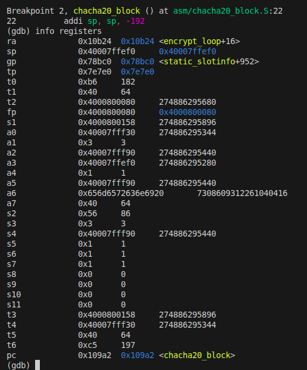
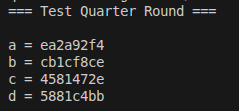
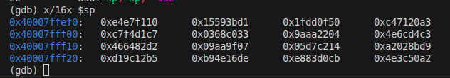
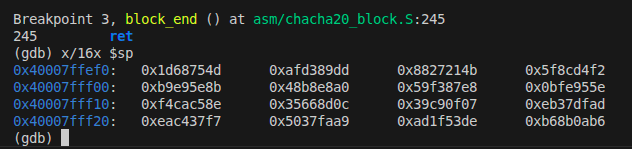
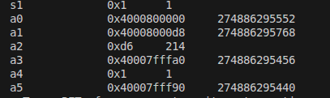
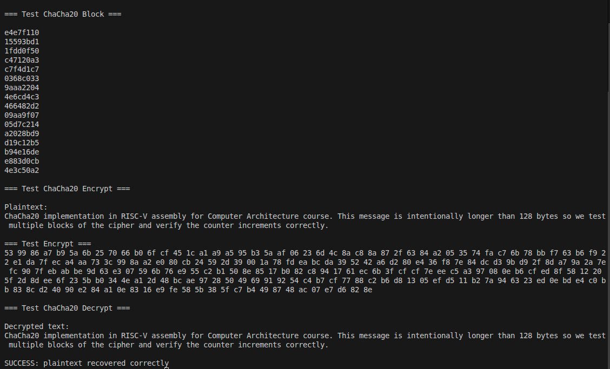

# Documentación Técnica — Implementación de ChaCha20 en RISC-V

## 1. Introducción

Este documento describe el diseño e implementación del algoritmo ChaCha20 utilizando ensamblador RISC-V.

El objetivo del proyecto es comprender cómo implementar primitivas criptográficas de bajo nivel y cómo interactúan con programas escritos en C.

La implementación sigue la especificación definida en:

RFC 8439  
---

# 2. Descripción del algoritmo ChaCha20

ChaCha20 es un cifrador de flujo diseñado por Daniel J. Bernstein.

El algoritmo genera un keystream de 64 bytes que luego se combina con el texto plano mediante XOR.

La estructura del estado ChaCha20 consiste en 16 palabras de 32 bits:

constant constant constant constant  
key key key key  
key key key key  
counter nonce nonce nonce  

Cada bloque se procesa mediante 20 rondas organizadas como:

- 10 column rounds
- 10 diagonal rounds

La operación fundamental del algoritmo es el quarter round.

---

## 3. Quarter Round

El *quarter round* es la operación fundamental del algoritmo ChaCha20.  
Esta operación mezcla cuatro palabras de 32 bits utilizando operaciones de suma modular, XOR y rotaciones de bits.

Las operaciones que definen el quarter round son:

a += b; d ^= a; d <<< 16  
c += d; b ^= c; b <<< 12  
a += b; d ^= a; d <<< 8  
c += d; b ^= c; b <<< 7  

Estas operaciones introducen **difusión y no linealidad** en el estado interno del algoritmo.

La implementación de esta función se encuentra en:

asm/quarter_round.S

## Implementación de rotaciones en RISC-V

El algoritmo ChaCha20 utiliza rotaciones de bits sobre palabras de 32 bits.  
Sin embargo, la ISA base de RISC-V no incluye una instrucción de rotación directa, por lo que estas se implementan utilizando instrucciones de desplazamiento lógico y una operación OR.

Una rotación a la izquierda se implementa de la siguiente manera:

(x <<< n) = (x << n) | (x >> (32 − n))

Por ejemplo, la rotación de 7 bits utilizada en el quarter round se implementa en ensamblador como:

slliw t4,t1,7  
srliw t5,t1,25  
or t1,t4,t5  

Las instrucciones terminadas en **`w`** operan sobre palabras de **32 bits**, lo cual coincide con el tamaño de las palabras utilizadas por el algoritmo ChaCha20.

El algoritmo ChaCha20 se basa en el modelo **ARX (Addition, Rotation, XOR)**, el cual resulta eficiente de implementar en arquitecturas RISC como RISC-V.

## Evidencia de ejecución

Las siguientes capturas muestran la ejecución del quarter round durante la depuración con GDB y la verificación del vector de prueba del RFC.

---
# 4. ChaCha20 Block Function

La función chacha20_block genera un bloque de keystream de 64 bytes.

Pasos principales del algoritmo:

1. Construir el estado inicial  
2. Copiar el estado a un working state  
3. Ejecutar 20 rondas  
4. Sumar el estado original al working state  
5. Escribir el resultado en memoria  

Archivo:

asm/chacha20_block.S

Estado inicial del bloque observado durante la depuración:

También se muestra el estado después de ejecutar las 20 rondas:

---

# 5. ChaCha20 Encryption

El cifrado se realiza combinando el keystream con el texto plano:

ciphertext = plaintext XOR keystream

La función chacha20_encrypt se encarga de:

- generar bloques de keystream
- aplicar XOR sobre el mensaje
- incrementar el contador para cada bloque

Archivo:

asm/chacha20_encrypt.S

Evidencias de ejecución:

Entrada a la función de cifrado:

Ejecución del cifrado:

---

# 6. Mapeo del estado ChaCha20 a registros RISC-V

El estado ChaCha20 consiste en 16 palabras de 32 bits.

Durante la implementación estas palabras se manipulan utilizando registros temporales y memoria en el stack.

Registros utilizados:

a0–a5  → parámetros de funciones  
t0–t6  → registros temporales  
s0–s5  → registros preservados  
ra     → dirección de retorno  
sp     → stack pointer  

El estado del bloque se almacena temporalmente en el stack frame, lo que permite acceder a las 16 palabras de manera indexada.

Esto facilita la implementación de las rondas y el acceso a los datos durante el proceso de cifrado.

---

# 7. Manejo del Stack Frame

Cada función en ensamblador crea su propio stack frame.

Ejemplo en chacha20_encrypt:

addi sp,sp,-128  
sd ra,120(sp)  
sd s0,112(sp)  
sd s1,104(sp)  

El stack se utiliza para:

- guardar registros preservados
- almacenar temporalmente bloques de keystream
- facilitar el acceso a estructuras de datos

Antes de salir de la función se restauran los registros y se libera el stack:

ld ra,120(sp)  
addi sp,sp,128  
ret  

---

# 8. Integración con C

El archivo src/main.c permite ejecutar pruebas del algoritmo.

El programa prueba tres componentes principales:

1. quarter round  
2. chacha20 block  
3. cifrado completo  

Esto facilita verificar que la implementación coincide con los vectores del RFC.

---

# 9. Ejecución en QEMU

El proyecto se ejecuta utilizando el emulador RISC-V:

qemu-riscv64 ./main

Esto permite ejecutar código RISC-V en una máquina x86.

---

# 10. Depuración con GDB

El proyecto permite depurar la ejecución utilizando:

gdb-multiarch

Conectándose a QEMU mediante:

target remote :1234

Esto permite:

- inspeccionar registros
- ejecutar instrucciones paso a paso
- observar el flujo del programa
- verificar el estado interno del algoritmo

Durante la depuración se pueden colocar breakpoints en funciones clave:

break chacha20_encrypt  
break chacha20_block  
break chacha20_quarter_round  

---

# 11. Resultados

Las pruebas ejecutadas coinciden con los vectores de prueba definidos en el RFC.

Ejemplo de salida del block function:

10f1e7e4  
d13b5915  
500fdd1f  
a32071c4  

Esto confirma que la implementación del algoritmo ChaCha20 es correcta.

---

# 12. Bitácora de bug

Durante el desarrollo se encontró un error relacionado con el manejo del contador del algoritmo ChaCha20.

Inicialmente el contador no se restauraba correctamente antes del proceso de descifrado, lo que producía un keystream distinto y causaba que el texto descifrado fuera incorrecto.

El problema se detectó durante la depuración utilizando GDB al observar los registros en la función chacha20_encrypt.

La solución consistió en guardar el contador original en un registro preservado y restaurarlo antes de iniciar el proceso de descifrado.

Una vez corregido el problema, el algoritmo produjo resultados correctos y el proceso de cifrado y descifrado funcionó correctamente.

Este error fue corregido durante el desarrollo y por esta razón no se tomó una captura del estado incorrecto.

---

# 13. Conclusiones

El proyecto demuestra que es posible implementar algoritmos criptográficos modernos en ensamblador RISC-V manteniendo eficiencia y claridad.

Durante el desarrollo se logró comprender:

- el funcionamiento interno del algoritmo ChaCha20
- la implementación de operaciones criptográficas en ensamblador
- el uso de registros y stack en RISC-V
- la interacción entre programas escritos en C y ensamblador
- el uso de herramientas de depuración como QEMU y GDB

La implementación final produce resultados consistentes con los vectores definidos en el RFC, confirmando la correcta funcionalidad del algoritmo.
